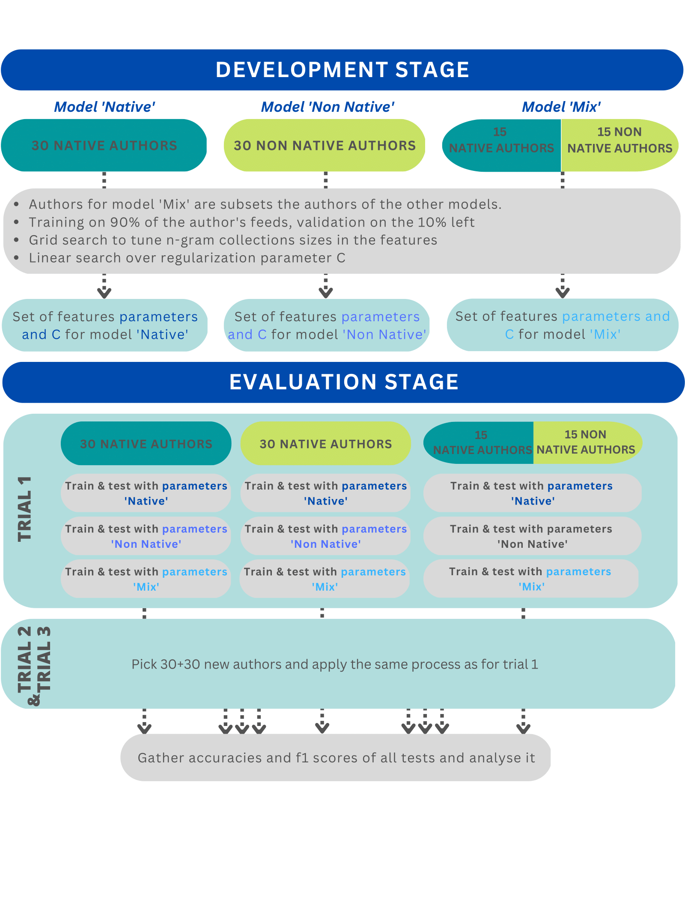

# project2-braindead

# **Language Stylometry Project**

# Abstract 

We investigate whether language proficiency variation has a performance impact on traditional stylometric author classification methods. Insight into this potential link could decrease incidence of misattribution of dangerous or illegal text.

In particular, we pursue multi-class author classification SVM models with Writeprints-inspired feature sets to aggregated english-language Reddit comments written by three cohorts: native English authors, non-native English authors, and a mix of the two. We find that applying SVMs to a mix of both native and non-native English authors consistently outperforms SVMs applied to either native or non-native authors alone.

Additionally, after tuning n-gram collection sizes specifically for each cohort, we do not find evidence of an ‘ideal’ set of model parameters for a given language proficiency level but we do find non-native authors consistently benefit more from variation in said parameters than do native authors.

# Structure of the study

The project is divided into three successive stages :
1.   **Preprocessing**
2.   **Development stage**
3.   **Evaluation stage**

In the **preprocessing stage**, we transform the raw data to extract only the comments we are interested in: we want the comments written in English by authors, native or not, having written more than 10'000 words in total. 
These comments are then grouped by documents of minimum 500 words (called 'feed'). At the end of this phase, each author has 20 feeds of about 500 words and are grouped by their proficiency: native or non-native.

**Development stage and evaluation stage** are described in the following diagram :



# Organization
   
    ├── Code
        ├── Development_and_Evaluation_Stages
        ├── Preprocessing
    ├── Data 
        ├── Inputs
            ├── After_Tuning
            ├── Linear_Search_Features
        ├── Outputs
            ├── Grid_Search_Features
            ├── Linear_Search_Hyperparameters
            ├── Evaluation_Stage
        ├── Preprocessing                       
        ├── Raw 
            ├── user_levels.csv
            ├── user_comments
                 └── .json files
        ├── Test
        ├── Tuning
            ├── Feature Tuning Dataframes

# How to install the project 
All the required packages are in the txt file `requirements.txt`.
## Data to download 
Some of the files are too big to be uploaded on GitHub. They are however available at [this link](https://drive.switch.ch/index.php/s/bVBCqB0ReuX8e6z). In order to make the code run, please follow these instructions.

* The folder `user_comments` containing all the .json files must be put into the folder `./Raw/`.
* The file `english_comments` must be in the folder `.Data/Preprocessing` 

# How to reproduce our results 

## Preprocessing

Running the Jupyter Notebook `Code/Preprocessing/preprocess.ipynb`, will transform raw data `user_comments` and `user_levels.csv` into a dataset containing only native and non-native english authors with more than 10'000 words written. The features will be extracted from this preprocessed dataset.

## Development stage
The development stage leads to three sets of parameters corresponding to the best models we could train respectively on native, non-native, and mixed cohorts. 

The accuracy and f1 score for each of these models can be obtained by following these steps :
-   Go in directory Code/Development_and_Evaluation_Stages 
-   Run ```python3 classify_script.py 0```
-   The results should appear in folder 'Outputs' with the names `Output_tuned_all.yaml`, `Output_tuned_native.yaml`, and `Output_nonnative_all.yaml`.

Example of how to read these output files : 

In file `Output_tuned_xxx.yaml`, look for accuracy and f1-score of 'model xxx' on 'cohort xxx'. They are the two scores reported in _Table 1. in our paper_.

## Evaluation stage 

To reproduce scores written in _Table 1. in the appendix_ and the ones used to produce _Figure 3._, please reach the directory `Code/Development_and_Evaluation_Stage` and then :
-   Run the two first cells of the notebook  `Evaluation_Stage.ipynb`
-   Jump to section 'Evaluation Stage' and run all cells until the end of the notebook
-   4 files should be created in folder Outputs, named `RESULTS_EVALUATION_STAGE_xxx.yaml`

The heat map in _Figure 3._ displays results from file `RESULTS_EVALUATION_STAGE.yaml`, while the three other files give the scores of _Table 1. (appendix)._
